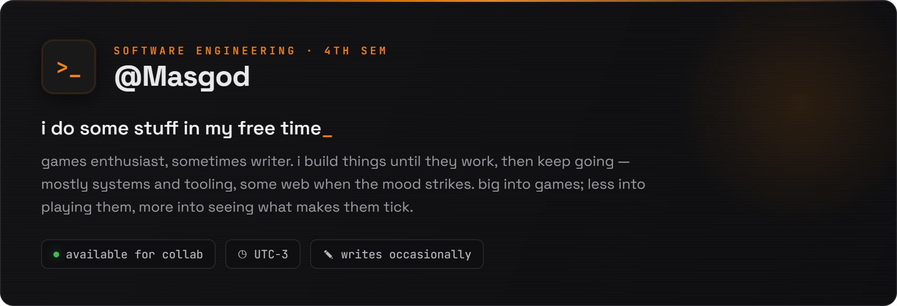

<!--
  Masgod — GitHub profile README
  HOW TO USE:
  1. Create a PUBLIC repo named exactly "Masgod" (must match your username).
  2. Put this file in it as README.md.
  3. Upload masgod-banner.png into the repo (e.g. an /assets folder) and fix the banner
      below to point at it. Easiest: drag the PNG into the repo on github.com,
     then copy its raw URL.
  Note: GitHub strips CSS, so the styled look comes from the banner image + the SVG
  stat cards + shields.io badges below. Colors are pre-themed to the orange/dark palette.
-->

<!-- ============ BANNER ============ -->

  

  <em>i do some stuff in my free time</em>

<!-- ============ STACK ============ -->
<h3 align="center">stack</h3>

  
  
  
  
  
  

<!-- ============ FOCUS ============ -->
<h3 align="center">focus</h3>

  
  
  
  

 

<!-- ============ STATS ============ -->

  
  

  

<!-- ============ CURRENTLY ============ -->
<h3 align="center">favorite animes</h3>

  <code>A Certain Scientific Railgun</code> &nbsp;·&nbsp; <code>Neon Genesis Evangelion</code>

<!--
  OPTIONAL — now playing (Spotify):
  Needs a one-time auth setup with a service like novatorem or spotify-github-profile.
  Once set up, embed its SVG here the same way as the cards above.
-->

  built after hours

